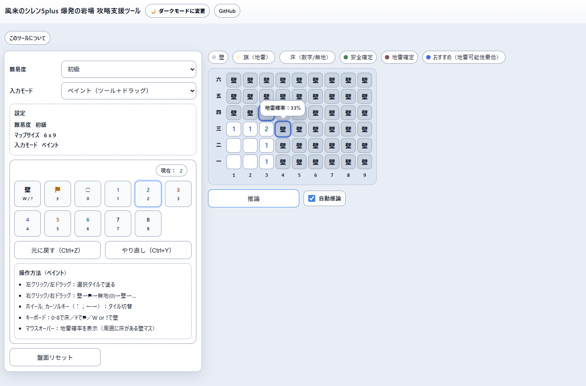

# 風来のシレン5plus 爆発の岩場 攻略支援ツール

このツールは「[不思議のダンジョン 風来のシレン5plus フォーチュンタワーと運命のダイス](https://www.spike-chunsoft.co.jp/pages/shiren5plus/)」に登場するダンジョン「[爆発の岩場](https://seesaawiki.jp/w/shiren5/d/%c7%fa%c8%af%a4%ce%b4%e4%be%ec)」の非公式攻略支援ツールです。

盤面の情報（未開マス／旗／数字）を入力すると、確定で安全なマス、確定で地雷のマスを推論してハイライト表示します。  
入力に矛盾がある場合は警告し、見直すべき箇所を示します。
確定で安全なマスがない場合、おすすめマスもハイライト表示します。

> 操作性の都合上、PCでの使用をおすすめします。

 <!-- markdownlint-disable-line MD033 -->

## 公開URL

<https://yukio0.github.io/bakuhatsu-no-iwaba>

## 使い方

1. 難易度を選択します（初級／中級／上級）
2. 盤面を入力します
3. 推論したい場合は「推論」を押します  
   ※「自動推論」がONのときは、クリックやドラッグ操作の後に自動で推論します
4. 盤面を最初からやり直したい場合は「盤面リセット」を押します

## 注意

- 本ツールは非公式であり、正確性や完全性を保証するものではありません。利用はご自身の責任で行ってください。
- 本ツールの利用または利用不能に起因して生じた損害について、作者は一切の責任を負いません。
- また、予告なく内容の変更や公開停止を行う場合があります。

## ライセンス

[MIT License](LICENSE)
